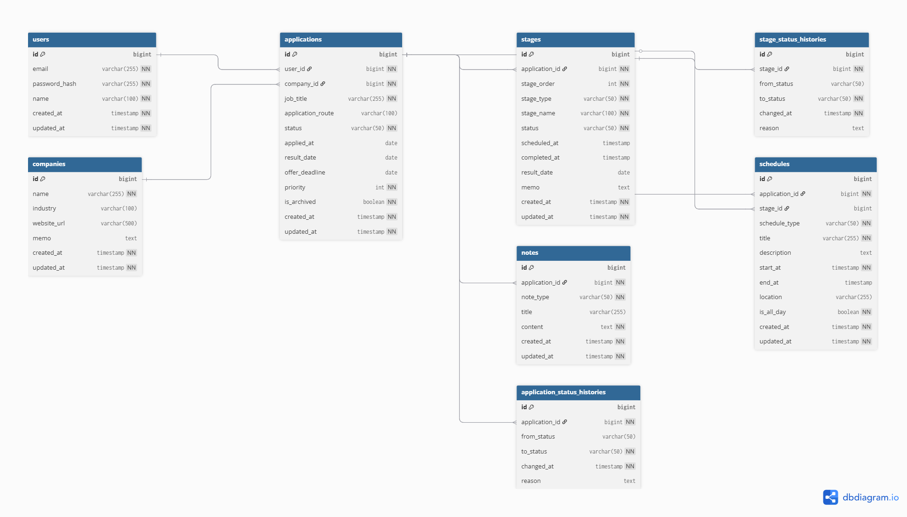

# Job Application Tracker

就職活動における応募情報・選考フロー・日程・メモを一元管理するためのアプリケーションです。

---

## 1. サービス概要

### 1-1. サービス一行定義
就職活動における応募状況・選考進捗・スケジュールを一元管理できるアプリ

### 1-2. 解決したい課題
就職活動では、企業ごとに応募状況や選考フロー、面接日程が分散しやすく、
以下のような問題が発生します。

- 応募状況の把握が難しい
- 面接日程や締切の管理が煩雑
- 選考の進捗が整理できない
- 志望動機や面接内容の記録が分散する

本サービスではこれらの情報を一元化し、効率的な就職活動を支援します。

---

### 1-3. MVP範囲

- 応募情報の登録・編集・削除（CRUD）
- 選考ステージの管理
- 面接・締切などのスケジュール管理
- メモ機能（志望動機・面接記録など）
- ステータス管理（応募〜内定まで）

---

## 2. 使用技術

- フロントエンド：React / Next.js
- バックエンド：Kotlin / Spring Boot
- 認証・認可：Spring Security / JWT
- データベース：PostgreSQL
- ORM：JPA (Hibernate)
- インフラ：AWS
- コンテナ：Docker
- キャッシュ：Redis（今後の拡張を想定）

---

## 2-1. 技術選定理由

本プロジェクトでは、単なる実装ではなく「実務で通用する設計・構成」を意識し、各技術を選定しています。

### フロントエンド：React / Next.js
ユーザーインターフェースの構築において、コンポーネント指向による再利用性と保守性を重視しました。  
また、Next.jsを採用することで、ルーティングやデータ取得を効率的に行い、実務に近いフロントエンド構成を意識しています。

### バックエンド：Kotlin / Spring Boot
企業での採用実績が多く、堅牢なAPI設計が可能なSpring Bootを採用しました。  
Kotlinを使用することで、Javaよりも簡潔かつ安全にコードを記述でき、開発効率と可読性の向上を図っています。

### 認証・認可：Spring Security / JWT
実務で一般的に使用される認証基盤としてSpring Securityを採用しました。  
JWTを利用することで、ステートレスな認証を実現し、スケーラビリティを考慮した設計としています。

### データベース：PostgreSQL
複雑なリレーションやトランザクション処理に強く、拡張性の高いRDBであるため採用しました。  
本システムのように複数テーブル間の関係が重要な場合に適していると判断しています。

### ORM：JPA (Hibernate)
オブジェクト指向でデータベース操作を行うことで、開発効率と保守性の向上を目的として採用しました。  
また、エンティティ間のリレーションを明確に表現できる点も重視しています。

### インフラ：AWS
実務での利用が多く、スケーラブルな構成を構築できるため採用しました。  
将来的な本番運用を見据えたインフラ設計を意識しています。

### コンテナ：Docker
開発環境と本番環境の差異をなくし、再現性の高い環境構築を実現するため採用しました。  
チーム開発やデプロイの効率化にも寄与します。

### キャッシュ：Redis（今後の拡張を想定）
現時点では必須ではありませんが、  
今後のパフォーマンス改善（例：ダッシュボード集計・頻繁なクエリ結果のキャッシュ）を想定し、導入を検討しています。

---

## 3. ERD

---

## 4. データベース設計

本システムでは、応募情報を中心に関連データを紐づける構造で設計しています。

---

### 4-1. users

ユーザーの認証情報および基本情報を管理するテーブル

---

### 4-2. companies

応募先企業の基本情報を管理するテーブル

---

### 4-3. applications

応募情報を管理する中心テーブル

本システムの中心となるテーブルであり、
すべての選考情報はこのテーブルを基準に管理されます。

- ユーザー × 企業 の関係を保持
- 応募職種・応募経路・現在のステータスを管理

#### ステータス例
- `NOT_STARTED`
- `APPLICATION`
- `INFO_SESSION`
- `DOCUMENT_SCREENING`
- `WEB_TEST`
- `CASUAL_MEETING`
- `INTERVIEW`
- `OFFERED`
- `REJECTED`

---

### 4-4. stages

各応募に紐づく選考ステージを管理

#### 設計意図
企業ごとに異なる選考フローに対応するため、
ステージを独立テーブルとして管理

#### ステータス例
- `pending`
- `scheduled`
- `completed`
- `passed`
- `failed`

---

### 4-5. schedules

面接・締切・結果通知などのスケジュールを管理

実務において、選考とは独立した締切や通知も存在するため、
両方を柔軟に扱える構造としています。

#### 設計意図
- 応募全体に紐づく予定
- 特定ステージに紐づく予定

の両方に対応できるように設計

---

### 4-6. notes

志望動機・面接内容・振り返りなどを記録

---

### 4-7. application_status_histories

応募全体のステータス変更履歴を管理

#### 設計意図
- 状態遷移を追跡可能にする
- 面接時に設計意図を説明可能

---

### 4-8. stage_status_histories

各選考ステージの状態変更履歴を管理

---

## 5. テーブル関係

- user 1 : N applications
- company 1 : N applications
- application 1 : N stages
- application 1 : N schedules
- application 1 : N notes
- application 1 : N application_status_histories
- stage 1 : N stage_status_histories

---

## 6. 設計ポイント

### 6-1. 応募中心設計
応募（applications）を中心にデータを集約することで、
就職活動の情報を一元管理できる構造にしました。

---

### 6-2. ステータスとステージの分離

- 応募全体の進捗 → `applications.status`
- 各選考段階の進捗 → `stages.status`

として分離することで、
粒度の異なる進捗管理を可能にしています。

`applications.status` は応募全体の大きなカテゴリを管理し、
`stages.status` は各選考ステージの詳細な進捗を管理します。

例:
- `applications.status = INTERVIEW`
- `stages.name = 一次面接`
- `stages.status = SCHEDULED`

---

### 6-3. 状態変更履歴の管理

履歴テーブルを設けることで、

- いつどの状態に変わったか
- 選考の流れ

を追跡できるようにしました。

---

### 6-4. 柔軟なスケジュール設計

スケジュールを

- 応募単位
- ステージ単位

の両方で扱えるようにすることで、
実務に近い柔軟な管理を実現しました。

---

## 7. 今後の改善

- 通知機能（面接・締切リマインド）
- カレンダー連携
- 分析機能（通過率・進捗可視化）
- モバイル対応UI

---

## 8. 想定ユーザー

- 就職活動中の学生
- 転職活動中の社会人

---

## 9. ステータス遷移の考え方

- `REJECTED` は終了状態
- `OFFERED` は最終状態
- ステータスは基本的に前進方向に遷移し、
  過去の状態に戻ることは想定していません。

応募全体の進捗は、以下のような大きなカテゴリで管理します。
- `NOT_STARTED`
- `APPLICATION`
- `INFO_SESSION`
- `DOCUMENT_SCREENING`
- `WEB_TEST`
- `CASUAL_MEETING`
- `INTERVIEW`
- `OFFERED`
- `REJECTED`

---

## 10. API設計

本システムでは、応募情報 (`applications`) を中心に、
選考ステージ・スケジュール・メモを紐づける形でAPIを設計しています。

RESTfulな設計を意識し、リソース単位で責務を分離しています。

---

### 10-1. 認証 API

ユーザー登録、ログイン、認証状態の確認を行うためのAPIです。

| Method | Endpoint | 説明 |
|---|---|---|
| POST | `/auth/signup` | 新規ユーザー登録 |
| POST | `/auth/login` | ログイン |
| POST | `/auth/refresh` | アクセストークンの再発行 |
| GET | `/auth/me` | 現在ログイン中のユーザー情報を取得 |

#### 設計意図
認証・認可はアプリケーション全体の基盤であるため、  
他のリソースとは分離して `/auth` 配下にまとめています。

---

### 10-2. 企業 API

応募先企業の基本情報を管理するためのAPIです。

| Method | Endpoint | 説明 |
|---|---|---|
| POST | `/companies` | 企業情報を登録 |
| GET | `/companies` | 企業一覧を取得 |
| GET | `/companies/{id}` | 特定企業の詳細を取得 |
| PATCH | `/companies/{id}` | 特定企業の情報を更新 |
| DELETE | `/companies/{id}` | 特定企業を削除 |

#### 設計意図
企業情報は応募情報の親となる基礎データであり、  
応募履歴とは独立して管理できるようにしています。

---

### 10-3. 応募情報 API

応募情報を管理する中心APIです。  
本システムでは、応募情報を軸として各種データを紐づけています。

| Method | Endpoint | 説明 |
|---|---|---|
| POST | `/applications` | 応募情報を登録 |
| GET | `/applications` | 応募情報一覧を取得 |
| GET | `/applications/{id}` | 特定応募情報の詳細を取得 |
| PATCH | `/applications/{id}` | 特定応募情報を更新 |
| DELETE | `/applications/{id}` | 特定応募情報を削除 |

#### 拡張API（検索・可視化）

| Method | Endpoint | 説明 |
|---|---|---|
| GET | `/applications?status=INTERVIEW&sort=updatedAt` | ステータス・ソート条件によるフィルタ取得 |
| GET | `/applications/{id}/timeline` | 応募のステータス履歴および選考ステージの進捗を統合し、時系列で可視化するためのAPI |

#### 設計意図
応募情報 (`applications`) は本システムの中心リソースであり、  
検索・並び替え・履歴の可視化といった拡張機能もこのリソースに集約しています。

---

### 10-4. 選考ステージ API

応募ごとの選考ステージを管理するためのAPIです。

| Method | Endpoint | 説明 |
|---|---|---|
| POST | `/applications/{id}/stages` | 特定応募に選考ステージを追加 |
| GET | `/applications/{id}/stages` | 特定応募の選考ステージ一覧を取得 |
| PATCH | `/stages/{id}` | 特定選考ステージを更新 |
| DELETE | `/stages/{id}` | 特定選考ステージを削除 |

#### 設計意図
選考フローは企業ごとに異なるため、  
応募単位で複数のステージを柔軟に追加・管理できる構造にしています。

---

### 10-5. スケジュール API

面接日程、締切、結果通知日などのスケジュールを管理するためのAPIです。

| Method | Endpoint | 説明 |
|---|---|---|
| POST | `/applications/{id}/schedules` | 特定応募にスケジュールを追加 |
| GET | `/applications/{id}/schedules` | 特定応募のスケジュール一覧を取得 |
| PATCH | `/schedules/{id}` | 特定スケジュールを更新 |
| DELETE | `/schedules/{id}` | 特定スケジュールを削除 |

#### 設計意図
スケジュールは応募全体に紐づく情報として扱い、  
必要に応じて選考ステージ単位の予定にも対応できるように設計しています。

---

### 10-6. メモ API

志望動機、面接内容、企業研究メモなどを管理するためのAPIです。

| Method | Endpoint | 説明 |
|---|---|---|
| POST | `/applications/{id}/notes` | 特定応募にメモを追加 |
| GET | `/applications/{id}/notes` | 特定応募のメモ一覧を取得 |
| PATCH | `/notes/{id}` | 特定メモを更新 |
| DELETE | `/notes/{id}` | 特定メモを削除 |

#### 設計意図
メモは応募単位で整理することで、  
企業ごとの志望動機、面接記録、振り返りを一元管理できるようにしています。

---

### 10-7. 統計 API（拡張機能）

今後の拡張として、応募状況を可視化するための統計APIを想定しています。

| Method | Endpoint | 説明 |
|---|---|---|
| GET | `/dashboard/summary` | 応募数・進行中件数・合否件数などの要約情報を取得 |
| GET | `/dashboard/stats` | 通過率やステージ別統計情報を取得 |

#### 想定する取得内容
- 総応募数
- 現在進行中の応募数
- 合格 / 不合格件数
- ステージ別通過率
- 応募状況の可視化データ

#### 設計意図
本システムは単なる記録ツールではなく、  
応募状況を分析し、次の行動判断に活かせる構造を目指しています。

---

## 11. API設計上のポイント

- 認証機能は `/auth` に分離し、責務を明確化
- 応募情報 (`applications`) を中心に、子リソースとして `stages` / `schedules` / `notes` を管理
- 企業情報 (`companies`) は応募情報と分離し、再利用可能な基礎データとして扱う
- 将来的にダッシュボード・分析機能へ拡張しやすいように統計APIを別系統で設計
