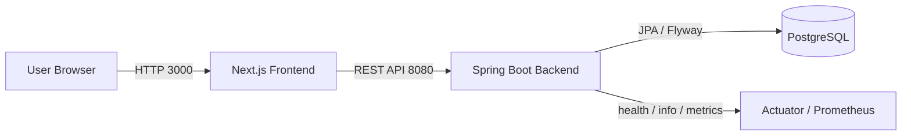
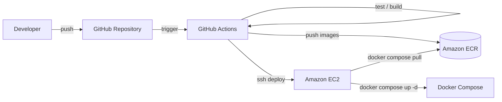

# Job Application Tracker

就職活動における企業、応募、選考ステージ、日程、メモを一元管理するためのアプリケーションです。  
バックエンドは Kotlin / Spring Boot、フロントエンドは Next.js で構成しています。

本リポジトリは、単純な CRUD 実装にとどまらず、認証、ユーザー単位のデータ分離、状態遷移制御、履歴管理、Flyway によるスキーマ管理、Docker による実行環境統一、GitHub Actions による CI/CD、AWS EC2 へのデプロイ、Terraform による IaC 検証、Actuator を用いた運用性向上まで含めて、バックエンド中心のポートフォリオとして整理しています。

---

## 構成

- `src/main/...`
  - Spring Boot バックエンド API
- `src/test/...`
  - バックエンドテスト
- `src/main/resources/db/migration`
  - Flyway マイグレーション
- `frontend/`
  - Next.js フロントエンド
- `Dockerfile`
  - バックエンド用 Dockerfile
- `frontend/Dockerfile`
  - フロントエンド用 Dockerfile
- `docker-compose.yml`
  - ローカル統合実行構成
- `.github/workflows/ci.yml`
  - GitHub Actions CI
- `.github/workflows/deploy-ec2.yml`
  - EC2 向けデプロイワークフロー
- `deploy/ec2/`
  - EC2 用デプロイ設定
- `terraform/`
  - AWS 用 Terraform 構成
- `docs/`
  - アーキテクチャ図、トラブルシューティング

---

## 技術スタック

### バックエンド

- Kotlin 1.9
- Spring Boot 3
- Spring Web
- Spring Security
- Spring Data JPA
- Spring Boot Actuator
- PostgreSQL
- H2 Database
- Flyway
- JJWT
- Micrometer Prometheus Registry
- Gradle Kotlin DSL

### フロントエンド

- Next.js 16
- React 19
- TypeScript
- Tailwind CSS 4

### DevOps / 開発環境

- Docker
- Docker Compose
- GitHub Actions
- AWS EC2
- AWS ECR
- Terraform

---

## 現在の実装範囲

### バックエンド API

- ユーザー登録
- ログイン
- 現在のログインユーザー取得
- 企業の作成 / 一覧 / 詳細 / 更新 / 削除
- 応募の作成 / 一覧 / 詳細 / 更新 / 削除
- 応募ステータス履歴取得
- 選考ステージの作成 / 一覧 / 更新 / 削除
- ステージステータス履歴取得
- 日程の作成 / 一覧 / 更新 / 削除
- メモの作成 / 一覧 / 更新 / 削除

### フロントエンド

- ログイン画面
- 応募一覧画面
- 応募作成画面
- 応募詳細画面
- 会社登録画面
- 応募一覧上部の簡易ダッシュボード
- 応募詳細画面でのステージ / 日程 / メモの追加
- 応募詳細画面でのステージ / 日程 / メモの修正 / 削除

### 開発基盤

- バックエンド Dockerfile
- フロントエンド Dockerfile
- `docker-compose.yml` による `frontend + backend + postgres` の統合起動
- GitHub Actions CI
  - バックエンドテスト
  - フロントエンド lint / build
  - バックエンド / フロントエンド Docker イメージビルド

### 運用性

- Actuator の導入
- `health`, `info`, `prometheus` エンドポイント公開
- `X-Request-Id` 付きリクエストログ
- Prometheus scrape を想定したメトリクス公開

### AWS / IaC

- EC2 + ECR を前提にしたデプロイワークフロー
- GitHub Actions による ECR push と EC2 デプロイ
- Terraform による dev 環境用インフラ定義
- AWS EC2 上での実デプロイ検証
- Terraform `plan / apply / destroy` 検証

---

## 設計上のポイント

### 1. ユーザー単位のデータ分離

すべての主要リソースはログイン中ユーザーに紐づいて管理されます。  
他ユーザーの企業、応募、ステージ、日程、メモにはアクセスできません。

### 2. ステータス履歴の自動生成

- `applications.status` が変化した場合、`application_status_histories` を自動生成
- `stages.status` が変化した場合、`stage_status_histories` を自動生成

### 3. 状態遷移の制御

応募とステージのステータスは任意に変更できるわけではなく、サービス層で許可された遷移のみを受け付けます。

応募ステータスの例:

- `NOT_STARTED -> APPLICATION`
- `APPLICATION -> INTERVIEW`
- `INTERVIEW -> OFFERED`
- `INTERVIEW -> REJECTED`
- `OFFERED` と `REJECTED` は終端状態

ステージステータスの例:

- `PENDING -> SCHEDULED`
- `SCHEDULED -> COMPLETED`
- `COMPLETED -> PASSED`
- `COMPLETED -> FAILED`
- `PASSED` と `FAILED` は終端状態

### 4. Flyway によるスキーマ管理

Hibernate の `ddl-auto` に依存せず、スキーマ変更は Flyway migration で管理しています。

- `V1__init.sql`
- `V2__integrity_constraints.sql`

### 5. DB 制約による整合性担保

現時点では以下を DB レベルで保証しています。

- `applications.priority` は `0..10`
- `stages` は `(application_id, stage_order)` を一意制約
- `schedules.end_at >= start_at`

### 6. 共通例外応答

エラー応答は `status`, `error`, `code`, `message`, `timestamp`, `errors` 形式に統一しています。

### 7. 環境分離

- `application.yaml`
  - 共通設定
- `application-local.yaml`
  - ローカル開発用設定
- `application-prod.yaml`
  - 本番想定設定
- `application-test.yaml`
  - テスト用設定

### 8. 運用性の確保

- Actuator によるヘルスチェック
- Prometheus エンドポイントによるメトリクス公開
- リクエスト単位のログ出力
- `X-Request-Id` によるリクエスト追跡

---

## データモデル

主なテーブルは以下の通りです。

- `users`
- `companies`
- `applications`
- `stages`
- `schedules`
- `notes`
- `application_status_histories`
- `stage_status_histories`

ERD:


---

## アーキテクチャ

### システム構成図



### デプロイフロー図



デプロイ構成、システム全体の詳細、デプロイ時の問題対応は以下に整理しています。

- [Architecture Diagram](./docs/architecture.md)
- [Troubleshooting](./docs/troubleshooting.md)

---

## API 一覧

### Auth

- `POST /auth/signup`
- `POST /auth/login`
- `GET /auth/me`

### Companies

- `POST /companies`
- `GET /companies`
- `GET /companies/{id}`
- `PATCH /companies/{id}`
- `DELETE /companies/{id}`

### Applications

- `POST /applications`
- `GET /applications`
- `GET /applications/{id}`
- `PATCH /applications/{id}`
- `DELETE /applications/{id}`
- `GET /applications/{id}/status-histories`

### Stages

- `POST /applications/{applicationId}/stages`
- `GET /applications/{applicationId}/stages`
- `PATCH /stages/{id}`
- `DELETE /stages/{id}`
- `GET /stages/{id}/status-histories`

### Schedules

- `POST /applications/{applicationId}/schedules`
- `GET /applications/{applicationId}/schedules`
- `PATCH /schedules/{id}`
- `DELETE /schedules/{id}`

### Notes

- `POST /applications/{applicationId}/notes`
- `GET /applications/{applicationId}/notes`
- `PATCH /notes/{id}`
- `DELETE /notes/{id}`

### Actuator

- `GET /actuator/health`
- `GET /actuator/info`
- `GET /actuator/prometheus`

---

## ローカル実行

### 前提

- Java 17
- Node.js 20 以上
- Docker

### 1. Docker Compose で起動

もっとも簡単な方法は以下です。

```powershell
docker compose up --build
```

ブラウザ:

- フロントエンド: `http://localhost:3000`
- バックエンド: `http://localhost:8080`

停止:

```powershell
docker compose down
```

### 2. バックエンドとフロントエンドを個別に起動する場合

#### PostgreSQL を起動

```powershell
docker run --name postgres-db `
  -e POSTGRES_USER=postgres `
  -e POSTGRES_PASSWORD=1234 `
  -e POSTGRES_DB=jobtracker `
  -p 5432:5432 `
  -d postgres:15
```

すでに作成済みの場合:

```powershell
docker start postgres-db
```

#### バックエンド環境変数を設定

```powershell
$env:DB_URL="jdbc:postgresql://localhost:5432/jobtracker"
$env:DB_USERNAME="postgres"
$env:DB_PASSWORD="1234"
$env:JWT_SECRET="change-this-secret-key-for-local-environment-only"
```

`.env` 相当の例:

```dotenv
DB_URL=jdbc:postgresql://localhost:5432/jobtracker
DB_USERNAME=postgres
DB_PASSWORD=1234
JWT_SECRET=change-this-secret-key-for-local-environment-only
JWT_ACCESS_TOKEN_EXPIRATION_SECONDS=3600
JWT_TOKEN_TYPE=Bearer
SERVER_PORT=8080
CORS_ALLOWED_ORIGINS=http://localhost:3000
```

#### バックエンド起動

```powershell
./gradlew bootRun
```

#### フロントエンド起動

```powershell
cd frontend
npm install
npm run dev
```

---

## 画面確認手順

### 1. ユーザー登録

現時点ではフロントに会員登録画面がないため、最初のユーザー作成は API から行います。

```powershell
curl.exe --% -X POST http://localhost:8080/auth/signup -H "Content-Type: application/json" -d "{\"email\":\"test@example.com\",\"password\":\"password123\",\"name\":\"テストユーザー\"}"
```

### 2. フロントエンドからログイン

- URL: `http://localhost:3000`
- メールアドレス: `test@example.com`
- パスワード: `password123`

### 3. 会社登録

- 画面右上ナビゲーションの `会社登録`
- または `http://localhost:3000/companies/new`

### 4. 応募作成

- `会社登録` 完了後、自動的に応募作成画面へ移動
- または `http://localhost:3000/applications/new`

### 5. 応募詳細確認

- 応募一覧から対象応募を選択
- ステージ / 日程 / メモの追加、修正、削除を確認

---

## Docker

### バックエンドイメージ

```powershell
docker build -t job-selection-tracker-backend:test .
```

### フロントエンドイメージ

```powershell
docker build -t job-selection-tracker-frontend:test ./frontend
```

---

## CI

GitHub Actions では以下を自動実行します。

- バックエンドテスト
- フロントエンド lint
- フロントエンド build
- バックエンド Docker イメージビルド
- フロントエンド Docker イメージビルド

ワークフロー:

- `.github/workflows/ci.yml`

---

## AWS デプロイ

### EC2 デプロイワークフロー

- `.github/workflows/deploy-ec2.yml`

### EC2 用 compose

- `deploy/ec2/docker-compose.prod.yml`
- `deploy/ec2/.env.example`

### GitHub Secrets

主に以下の Secrets を使用します。

- `AWS_ACCESS_KEY_ID`
- `AWS_SECRET_ACCESS_KEY`
- `AWS_REGION`
- `EC2_HOST`
- `EC2_USERNAME`
- `EC2_SSH_PRIVATE_KEY`
- `NEXT_PUBLIC_API_BASE_URL`
- `POSTGRES_USER`
- `POSTGRES_PASSWORD`
- `POSTGRES_DB`
- `JWT_SECRET`
- `JWT_ACCESS_TOKEN_EXPIRATION_SECONDS`
- `JWT_TOKEN_TYPE`
- `CORS_ALLOWED_ORIGINS`

### デプロイ確認

AWS EC2 上で以下を確認済みです。

- フロントエンド: `http://<EC2_PUBLIC_IP>:3000`
- バックエンドヘルスチェック: `http://<EC2_PUBLIC_IP>:8080/actuator/health`

ヘルスチェックは以下のレスポンスを返します。

```json
{
  "status": "UP",
  "groups": [
    "liveness",
    "readiness"
  ]
}
```

---

## Terraform

Terraform では以下を定義しています。

- ECR リポジトリ
  - backend
  - frontend
- EC2
- Security Group
- IAM Role / Instance Profile
- Docker / Docker Compose を導入する `user_data`

対象ファイル:

- `terraform/envs/dev`
- `terraform/modules/app_platform`

検証内容:

- `terraform plan`
- `terraform apply`
- `terraform destroy`

検証時は既存の手動デプロイ済みリソースと衝突しないように、`job-selection-tracker-tf-*` の検証用リソース名を使用しました。  
検証後、作成した Terraform 管理リソースは `terraform destroy` で削除済みです。

---

## テスト

### バックエンド

```powershell
./gradlew test
```

検証している主な内容:

- 認証 API の基本動作
- ユーザー所有データへのアクセス制御
- 例外応答コード
- ステータス履歴生成
- ステータス遷移制御
- DB 制約違反時の応答
- サービス層のドメインルール

### フロントエンド

```powershell
cd frontend
npm run lint
npm run build
```

---

## 現在の到達点

- バックエンド整備は完了
- フロント実装は完了
- Dockerfile はバックエンド / フロントエンドともに作成済み
- `docker-compose.yml` によるローカル統合実行は作成済み
- GitHub Actions CI は作成済み
- GitHub Actions による EC2 デプロイワークフローは作成済み
- Actuator / ログ / モニタリングの基本構成は追加済み
- AWS EC2 への実デプロイ検証は完了
- Terraform `plan / apply / destroy` 検証は完了
- アーキテクチャ図は追加済み
- トラブルシューティング文書は追加済み

---

## 今後の予定

- SSH デプロイから SSM Run Command ベースのデプロイへの改善
- ALB / HTTPS 対応
- RDS への DB 分離
- README の最終 polishing
