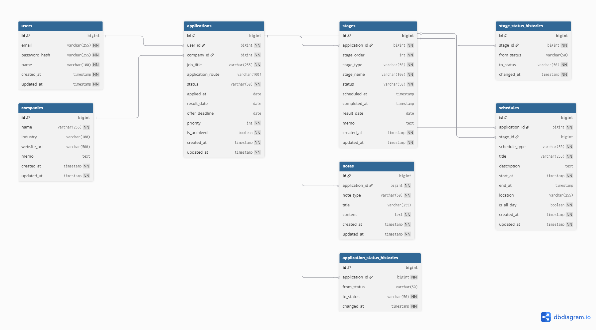
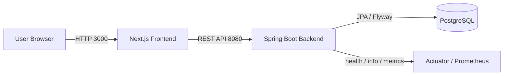
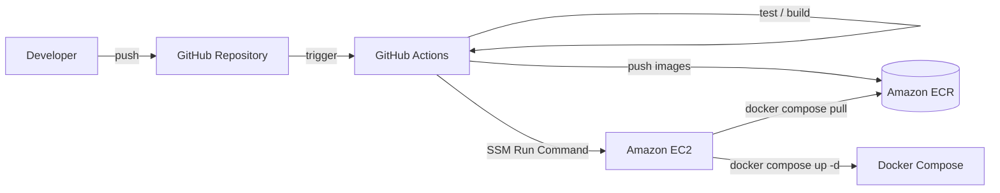
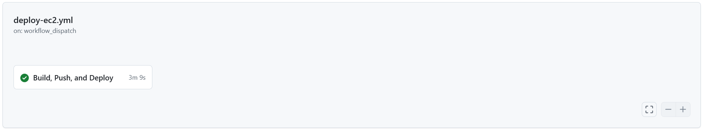

# Job Application Tracker

就職活動における企業、応募、選考ステージ、日程、メモを一元管理するためのアプリケーションです。  
バックエンドは Kotlin / Spring Boot、フロントエンドは Next.js で構成しています。

本リポジトリは、単純な CRUD 実装にとどまらず、認証、ユーザー単位のデータ分離、状態遷移制御、履歴管理、Flyway によるスキーマ管理、Docker による実行環境統一、GitHub Actions による CI/CD、AWS EC2 へのデプロイ、Terraform による IaC 検証、Actuator を用いた運用性向上まで含めて、バックエンド中心のポートフォリオとして整理しています。

## このプロジェクトで示せること

- Kotlin / Spring Boot による REST API 設計と、認証・認可を含むバックエンド実装
- ユーザー単位のデータ分離、状態遷移制御、履歴管理などの業務ルール実装
- Flyway と DB 制約を用いたスキーマ管理、データ整合性の担保
- Docker / Docker Compose によるローカル実行環境とデプロイ環境の標準化
- GitHub Actions、Amazon ECR、EC2、Terraform を用いた CI/CD と IaC の検証

---

## 構成

- `src/main/...`
  - Spring Boot バックエンド API
- `src/test/...`
  - バックエンドテスト
- `src/main/resources/db/migration`
  - Flyway マイグレーション
- `frontend/`
  - Next.js フロントエンド
- `Dockerfile`
  - バックエンド用 Dockerfile
- `frontend/Dockerfile`
  - フロントエンド用 Dockerfile
- `docker-compose.yml`
  - ローカル統合実行構成
- `.github/workflows/ci.yml`
  - GitHub Actions CI
- `.github/workflows/deploy-ec2.yml`
  - EC2 向けデプロイワークフロー
- `deploy/ec2/`
  - EC2 用デプロイ設定
- `terraform/`
  - AWS 用 Terraform 構成
- `docs/`
  - API 仕様、アーキテクチャ図、検証結果、トラブルシューティング

---

## 技術スタック

### バックエンド

- Kotlin 1.9
- Spring Boot 3
- Spring Web
- Spring Security
- Spring Data JPA
- Spring Boot Actuator
- PostgreSQL
- H2 Database
- Flyway
- JJWT
- Micrometer Prometheus Registry
- Gradle Kotlin DSL

### フロントエンド

- Next.js 16
- React 19
- TypeScript
- Tailwind CSS 4

### DevOps / 開発環境

- Docker
- Docker Compose
- GitHub Actions
- AWS EC2
- AWS ECR
- Terraform

---

## 現在の実装範囲

### バックエンド API

- ユーザー登録
- ログイン
- 現在のログインユーザー取得
- 企業の作成 / 一覧 / 詳細 / 更新 / 削除
- 応募の作成 / 一覧 / 詳細 / 更新 / 削除
- 応募一覧のステータス絞り込み / アーカイブ絞り込み / 会社名・職種検索 / ページング
- 応募ステータス履歴取得
- 選考ステージの作成 / 一覧 / 更新 / 削除
- ステージステータス履歴取得
- 日程の作成 / 一覧 / 更新 / 削除
- メモの作成 / 一覧 / 更新 / 削除

### フロントエンド

- ログイン画面
- 応募一覧画面
- 応募作成画面
- 応募詳細画面
- 会社登録画面
- 応募一覧上部の簡易ダッシュボード
- 応募一覧画面での検索 / 絞り込み / ページ移動
- 応募詳細画面でのステージ / 日程 / メモの追加
- 応募詳細画面でのステージ / 日程 / メモの修正 / 削除

### 開発基盤

- バックエンド Dockerfile
- フロントエンド Dockerfile
- `docker-compose.yml` による `frontend + backend + postgres` の統合起動
- GitHub Actions CI
  - バックエンドテスト
  - フロントエンド lint / build
  - バックエンド / フロントエンド Docker イメージビルド

### 運用性

- Actuator の導入
- ローカルでは `health`, `info`, `prometheus` を公開
- 本番想定環境では外部公開する Actuator endpoint を `health` に制限
- `X-Request-Id` 付きリクエストログ
- Prometheus scrape を想定したメトリクス公開

### AWS / IaC

- EC2 + ECR を前提にしたデプロイワークフロー
- GitHub Actions OIDC による IAM Role assume、ECR push、SSM Run Command 経由の EC2 デプロイ
- Terraform による dev 環境用インフラ定義
- Terraform remote backend
  - S3 state bucket
  - DynamoDB lock table
- AWS EC2 上での実デプロイ検証
- Terraform `plan / apply / destroy` 検証

---

## 設計上のポイント

### 1. ユーザー単位のデータ分離

すべての主要リソースはログイン中ユーザーに紐づいて管理されます。  
他ユーザーの企業、応募、ステージ、日程、メモにはアクセスできません。

### 2. ステータス履歴の自動生成

- `applications.status` が変化した場合、`application_status_histories` を自動生成
- `stages.status` が変化した場合、`stage_status_histories` を自動生成

### 3. 状態遷移の制御

応募とステージのステータスは任意に変更できるわけではなく、サービス層で許可された遷移のみを受け付けます。

応募ステータスの例:

- `NOT_STARTED -> APPLICATION`
- `APPLICATION -> INTERVIEW`
- `INTERVIEW -> OFFERED`
- `INTERVIEW -> REJECTED`
- `OFFERED` と `REJECTED` は終端状態

ステージステータスの例:

- `PENDING -> SCHEDULED`
- `SCHEDULED -> COMPLETED`
- `COMPLETED -> PASSED`
- `COMPLETED -> FAILED`
- `PASSED` と `FAILED` は終端状態

### 4. Flyway によるスキーマ管理

Hibernate の `ddl-auto` に依存せず、スキーマ変更は Flyway migration で管理しています。

- `V1__init.sql`
- `V2__integrity_constraints.sql`

### 5. DB 制約による整合性担保

現時点では以下を DB レベルで保証しています。

- `applications.priority` は `0..10`
- `stages` は `(application_id, stage_order)` を一意制約
- `schedules.end_at >= start_at`

### 6. 共通例外応答

エラー応答は `status`, `error`, `code`, `message`, `timestamp`, `errors` 形式に統一しています。

### 7. 環境分離

- `application.yaml`
  - 共通設定
- `application-local.yaml`
  - ローカル開発用設定
- `application-prod.yaml`
  - 本番想定設定
- `application-test.yaml`
  - テスト用設定

### 8. 運用性の確保

- Actuator によるヘルスチェック
- Prometheus エンドポイントによるメトリクス公開
- リクエスト単位のログ出力
- `X-Request-Id` によるリクエスト追跡

---

## データモデル

主なテーブルは以下の通りです。

- `users`
- `companies`
- `applications`
- `stages`
- `schedules`
- `notes`
- `application_status_histories`
- `stage_status_histories`

ERD:



---

## アーキテクチャ

### システム構成図



### デプロイフロー図



デプロイ構成、システム全体の詳細、デプロイ時の問題対応は以下に整理しています。

- [API Reference](./docs/api.md)
- [Architecture Diagram](./docs/architecture.md)
- [Verification](./docs/verification.md)
- [Troubleshooting](./docs/troubleshooting.md)

---

## 実行・検証結果

ローカル実行、CI、EC2 デプロイ、Terraform による IaC 検証まで確認しています。
詳細なログと追加スクリーンショットは [Verification](./docs/verification.md) に整理しています。

### ローカル実行

Docker Compose により `frontend + backend + postgres` を起動し、フロントエンド画面表示とバックエンドヘルスチェックを確認しました。

- フロントエンド: `http://localhost:3000`
- バックエンドヘルスチェック: `http://localhost:8080/actuator/health`


ヘルスチェック:

```json
{
  "status": "UP",
  "groups": [
    "liveness",
    "readiness"
  ]
}
```

### GitHub Actions CI

`ci.yml` により、バックエンドテスト、フロントエンド lint / build、Docker イメージビルドがすべて成功することを確認しました。


### AWS EC2 デプロイ

`deploy-ec2.yml` を手動実行し、Amazon ECR への Docker イメージ push と EC2 上での Docker Compose デプロイが成功することを確認しました。


SSM Run Command 移行後のデプロイ成功:



EC2 上のフロントエンド:


EC2 上でもバックエンドヘルスチェックが `UP` を返すことを確認しています。

### Terraform

`terraform/envs/dev` で `terraform plan / apply / destroy` を実行し、dev 環境向け AWS リソースの作成と削除を確認しました。

`terraform/envs/remote-state` で S3 backend と DynamoDB lock table を作成し、`terraform/envs/github-oidc` と `terraform/envs/dev` の state を S3 backend に移行しました。

検証した主なリソース:

- ECR repository
- EC2 instance
- Security Group
- IAM Role / Instance Profile
- GitHub Actions OIDC Provider / deploy IAM Role
- Terraform state 用 S3 bucket
- Terraform lock 用 DynamoDB table
- IAM Role Policy Attachment

---

## API 一覧

### Auth

- `POST /auth/signup`
- `POST /auth/login`
- `GET /auth/me`

### Companies

- `POST /companies`
- `GET /companies`
- `GET /companies/{id}`
- `PATCH /companies/{id}`
- `DELETE /companies/{id}`

### Applications

- `POST /applications`
- `GET /applications`
  - `status`, `isArchived`, `keyword`, `page`, `size` による絞り込み・検索・ページングに対応
- `GET /applications/{id}`
- `PATCH /applications/{id}`
- `DELETE /applications/{id}`
- `GET /applications/{id}/status-histories`

### Stages

- `POST /applications/{applicationId}/stages`
- `GET /applications/{applicationId}/stages`
- `PATCH /stages/{id}`
- `DELETE /stages/{id}`
- `GET /stages/{id}/status-histories`

### Schedules

- `POST /applications/{applicationId}/schedules`
- `GET /applications/{applicationId}/schedules`
- `PATCH /schedules/{id}`
- `DELETE /schedules/{id}`

### Notes

- `POST /applications/{applicationId}/notes`
- `GET /applications/{applicationId}/notes`
- `PATCH /notes/{id}`
- `DELETE /notes/{id}`

### Actuator

- `GET /actuator/health`
- `GET /actuator/info` local profile
- `GET /actuator/prometheus` local profile

---

## ローカル実行

### 前提

- Java 17
- Node.js 20 以上
- Docker

### 1. Docker Compose で起動

もっとも簡単な方法は以下です。

```powershell
docker compose up --build
```

ブラウザ:

- フロントエンド: `http://localhost:3000`
- バックエンド: `http://localhost:8080`

停止:

```powershell
docker compose down
```

### 2. バックエンドとフロントエンドを個別に起動する場合

#### PostgreSQL を起動

```powershell
docker run --name postgres-db `
  -e POSTGRES_USER=postgres `
  -e POSTGRES_PASSWORD=1234 `
  -e POSTGRES_DB=jobtracker `
  -p 5432:5432 `
  -d postgres:15
```

すでに作成済みの場合:

```powershell
docker start postgres-db
```

#### バックエンド環境変数を設定

```powershell
$env:DB_URL="jdbc:postgresql://localhost:5432/jobtracker"
$env:DB_USERNAME="postgres"
$env:DB_PASSWORD="1234"
$env:JWT_SECRET="change-this-secret-key-for-local-environment-only"
```

`.env` 相当の例:

```dotenv
DB_URL=jdbc:postgresql://localhost:5432/jobtracker
DB_USERNAME=postgres
DB_PASSWORD=1234
JWT_SECRET=change-this-secret-key-for-local-environment-only
JWT_ACCESS_TOKEN_EXPIRATION_SECONDS=3600
JWT_TOKEN_TYPE=Bearer
SERVER_PORT=8080
CORS_ALLOWED_ORIGINS=http://localhost:3000
```

#### バックエンド起動

```powershell
./gradlew bootRun
```

#### フロントエンド起動

```powershell
cd frontend
npm install
npm run dev
```

---

## 画面確認手順

### 1. ユーザー登録

現時点ではフロントに会員登録画面がないため、最初のユーザー作成は API から行います。

```powershell
curl.exe --% -X POST http://localhost:8080/auth/signup -H "Content-Type: application/json" -d "{\"email\":\"test@example.com\",\"password\":\"password123\",\"name\":\"テストユーザー\"}"
```

### 2. フロントエンドからログイン

- URL: `http://localhost:3000`
- メールアドレス: `test@example.com`
- パスワード: `password123`

### 3. 会社登録

- 画面右上ナビゲーションの `会社登録`
- または `http://localhost:3000/companies/new`

### 4. 応募作成

- `会社登録` 完了後、自動的に応募作成画面へ移動
- または `http://localhost:3000/applications/new`

### 5. 応募詳細確認

- 応募一覧から対象応募を選択
- ステージ / 日程 / メモの追加、修正、削除を確認

---

## Docker

### バックエンドイメージ

```powershell
docker build -t job-selection-tracker-backend:test .
```

### フロントエンドイメージ

```powershell
docker build -t job-selection-tracker-frontend:test ./frontend
```

---

## CI

GitHub Actions では以下を自動実行します。

- バックエンドテスト
- フロントエンド lint
- フロントエンド build
- バックエンド Docker イメージビルド
- フロントエンド Docker イメージビルド

ワークフロー:

- `.github/workflows/ci.yml`

---

## AWS デプロイ

### EC2 デプロイワークフロー

- `.github/workflows/deploy-ec2.yml`

デプロイは SSH / SCP ではなく AWS Systems Manager Run Command で実行します。
GitHub Actions は OIDC で AWS IAM Role を assume し、SSM 経由で EC2 上の Docker Compose を更新します。

### EC2 用 compose

- `deploy/ec2/docker-compose.prod.yml`
- `deploy/ec2/.env.example`

### GitHub Secrets

主に以下の Secrets を使用します。

- `AWS_ROLE_TO_ASSUME`
- `AWS_REGION`
- `EC2_INSTANCE_ID`
- `NEXT_PUBLIC_API_BASE_URL`
- `POSTGRES_USER`
- `POSTGRES_PASSWORD`
- `POSTGRES_DB`
- `JWT_SECRET`
- `JWT_ACCESS_TOKEN_EXPIRATION_SECONDS`
- `JWT_TOKEN_TYPE`
- `CORS_ALLOWED_ORIGINS`

AWS 認証は long-lived access key を GitHub Secrets に保存せず、GitHub Actions OIDC で AWS IAM Role を assume する構成です。
`terraform/envs/github-oidc` で `github_repository` を設定すると、`deploy-ec2.yml` 用の OIDC Role を作成できます。

`EC2_INSTANCE_ID` は SSM Run Command の対象 EC2 instance ID です。Terraform で dev 環境を作成した場合は、`terraform output ec2_instance_id` で確認できます。

### デプロイ確認

AWS EC2 上で以下を確認済みです。

- フロントエンド: `http://<EC2_PUBLIC_IP>:3000`
- バックエンドヘルスチェック: `http://<EC2_PUBLIC_IP>:8080/actuator/health`

ヘルスチェックは以下のレスポンスを返します。

```json
{
  "status": "UP",
  "groups": [
    "liveness",
    "readiness"
  ]
}
```

---

## Terraform

Terraform では以下を定義しています。

- ECR リポジトリ
  - backend
  - frontend
- EC2
- Security Group
- IAM Role / Instance Profile
- Docker / Docker Compose を導入する `user_data`
- GitHub Actions OIDC 用 IAM Role
- Terraform remote backend 用 S3 bucket / DynamoDB lock table

対象ファイル:

- `terraform/envs/dev`
  - EC2 / ECR / Security Group などの dev 検証用インフラ
- `terraform/envs/github-oidc`
  - GitHub Actions から AWS IAM Role を assume するための永続的な認証基盤
- `terraform/envs/remote-state`
  - Terraform remote backend 用の S3 bucket / DynamoDB lock table
- `terraform/modules/app_platform`

検証内容:

- `terraform/envs/dev` での `terraform plan`
- `terraform/envs/dev` での `terraform apply`
- `terraform/envs/dev` での `terraform destroy`
- `terraform/envs/github-oidc` での OIDC Role 作成
- `terraform/envs/remote-state` による S3 backend / DynamoDB lock 構成
- `terraform/envs/github-oidc` の S3 backend migration
- `terraform/envs/dev` の S3 backend 初期化と remote backend 経由の `terraform plan`

検証時は既存の手動デプロイ済みリソースと衝突しないように、`job-selection-tracker-tf-*` の検証用リソース名を使用しました。  
検証後、作成した Terraform 管理リソースは `terraform destroy` で削除済みです。

GitHub Actions OIDC Role は `terraform/envs/github-oidc` で dev 検証環境とは別 state として管理します。
これにより、`terraform/envs/dev` を `destroy` してもデプロイ用 IAM Role は削除されません。

GitHub Actions OIDC Role を作成する場合は、`terraform/envs/github-oidc/terraform.tfvars` で以下を設定します。

```hcl
github_repository    = "Li-Bertygi/job-selection-tracker"
github_deploy_branch = "main"
```

AWS アカウントに GitHub Actions OIDC Provider がすでに存在する場合は、`github_oidc_provider_arn` に既存 ARN を指定します。

`terraform/envs/github-oidc` で `terraform apply` 後に出力される `github_actions_role_arn` を GitHub Secret `AWS_ROLE_TO_ASSUME` に登録します。

SSM Run Command デプロイを使うため、OIDC Role には ECR push 権限に加えて `ssm:SendCommand` と command invocation 参照権限を付与しています。

Terraform remote state の構成手順は [Terraform Remote State](./docs/terraform-remote-state.md) に整理しています。

remote state 検証では、以下を確認済みです。

- remote state 用 S3 bucket / DynamoDB lock table の作成
- `github-oidc` stack の remote backend migration
- `github-oidc` stack の `terraform plan` 差分なし
- `dev` stack の S3 backend 初期化
- `dev` stack の remote backend 経由 `terraform plan`

---

## テスト

### バックエンド

```powershell
./gradlew test
```

検証している主な内容:

- 認証 API の基本動作
- ユーザー所有データへのアクセス制御
- 例外応答コード
- ステータス履歴生成
- ステータス遷移制御
- DB 制約違反時の応答
- サービス層のドメインルール

### フロントエンド

```powershell
cd frontend
npm run lint
npm run build
```

---

## 現在の到達点

- バックエンド整備は完了
- フロント実装は完了
- Dockerfile はバックエンド / フロントエンドともに作成済み
- `docker-compose.yml` によるローカル統合実行は検証済み
- GitHub Actions CI は検証済み
- GitHub Actions による EC2 デプロイワークフローは検証済み
- SSH / SCP ではなく SSM Run Command による EC2 デプロイは検証済み
- Actuator / ログ / モニタリングの基本構成は追加済み
- AWS EC2 への実デプロイ検証は完了
- Terraform `plan / apply / destroy` 検証は完了
- Terraform remote backend 検証は完了
- アーキテクチャ図は追加済み
- 検証結果ドキュメントは追加済み
- トラブルシューティング文書は追加済み

---

## 今後の予定

- ALB / HTTPS 対応
- RDS への DB 分離
