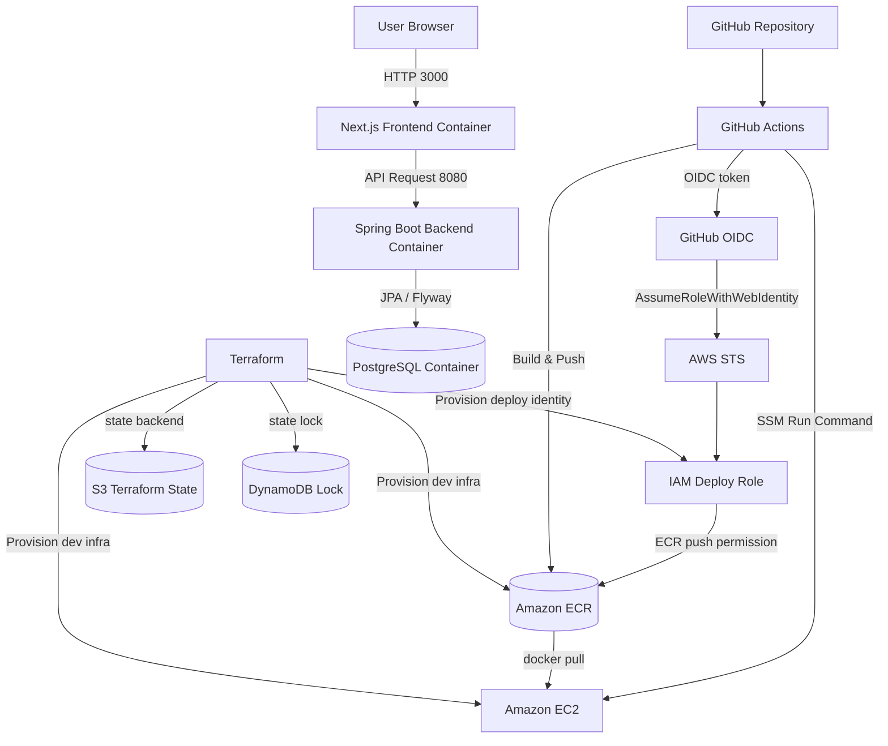
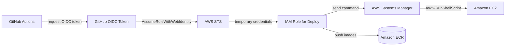
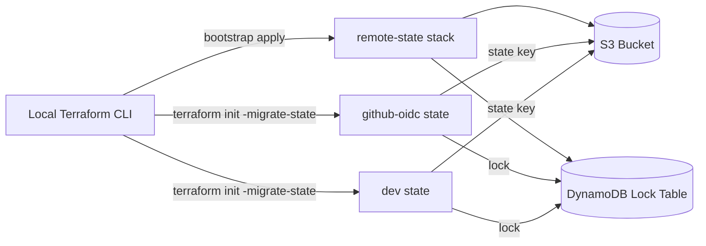

# Architecture

## システム構成

現在想定しているデプロイ構成は、`GitHub Actions + Amazon ECR + EC2 + Docker Compose` を基本としています。  
ローカルでは `docker-compose.yml`、AWS では `deploy/ec2/docker-compose.prod.yml` を使って同じ役割のコンテナ群を起動します。

GitHub Actions から AWS へアクセスする際は、長期 access key を GitHub Secrets に保存せず、GitHub OIDC と AWS IAM Role assume を利用します。



## データフロー

### 1. アプリケーション利用時

1. ユーザーはブラウザから Next.js フロントエンドにアクセスします。
2. フロントエンドは JWT を使って Spring Boot バックエンド API を呼び出します。
3. バックエンドは PostgreSQL に対して応募、ステージ、日程、メモを永続化します。
4. スキーマ変更は Flyway migration で管理します。

### 2. デプロイ時

1. GitHub に push すると GitHub Actions が起動します。
2. GitHub Actions は OIDC token を使って AWS STS の `AssumeRoleWithWebIdentity` を実行し、デプロイ用 IAM Role を assume します。
3. バックエンドとフロントエンドの Docker イメージをビルドします。
4. assume した IAM Role の権限で、ビルドしたイメージを Amazon ECR に push します。
5. GitHub Actions は AWS Systems Manager Run Command を実行し、EC2 上で `docker compose pull && docker compose up -d` を実行します。

## CI/CD 認証設計

GitHub Actions の AWS 認証は、`AWS_ACCESS_KEY_ID` / `AWS_SECRET_ACCESS_KEY` を使う方式から、OIDC + IAM Role assume 方式へ変更しています。



GitHub Secrets には以下を登録します。

```text
AWS_ROLE_TO_ASSUME
AWS_REGION
EC2_INSTANCE_ID
```

`AWS_ROLE_TO_ASSUME` は `terraform/envs/github-oidc` の output である `github_actions_role_arn` を使用します。

IAM Role の trust policy は、以下のように対象 repository と branch を制限します。

```text
repo:Li-Bertygi/job-selection-tracker:ref:refs/heads/main
```

これにより、GitHub Actions のデプロイ実行時にのみ一時 credentials を発行し、long-lived access key を GitHub Secrets に保存しない構成にしています。

## Terraform stack 分離

Terraform は、検証用インフラとデプロイ認証基盤の lifecycle を分けるため、stack を分離しています。

```text
terraform/envs/github-oidc
  - GitHub Actions OIDC Provider
  - GitHub Actions deploy IAM Role
  - ECR push policy

terraform/envs/dev
  - ECR repository
  - EC2
  - Security Group
  - EC2 IAM Role / Instance Profile
  - user_data

terraform/envs/remote-state
  - S3 bucket for Terraform state
  - DynamoDB lock table
```

`terraform/envs/github-oidc` は、GitHub Actions のデプロイ認証基盤として維持します。
一方で、`terraform/envs/dev` は検証用の AWS リソースとして `terraform apply / destroy` を行える構成です。

この分離により、dev 環境を destroy しても `AWS_ROLE_TO_ASSUME` が参照する IAM Role は削除されません。

Remote state 用の S3 bucket では versioning、server-side encryption、public access block を有効化し、DynamoDB table による lock で同時実行時の state 破損を防ぎます。

## Terraform state 管理

Terraform state は、検証初期段階では local state で管理していました。
現在は `terraform/envs/remote-state` で bootstrap した S3 backend と DynamoDB lock table を使い、`github-oidc` と `dev` の state を remote backend に分離しています。



state key は用途ごとに分けています。

```text
job-selection-tracker/github-oidc/terraform.tfstate
job-selection-tracker/dev/terraform.tfstate
```

`github-oidc` stack はデプロイ認証基盤として維持する state、`dev` stack は検証用インフラとして apply / destroy 可能な state です。
remote state の bootstrap stack 自体は、S3 backend の土台を作るための管理単位として扱います。

## インフラ構成の要点

- EC2 はアプリケーション実行基盤です。
- ECR はバックエンド / フロントエンドの Docker イメージ保管先です。
- Terraform は ECR、EC2、Security Group、IAM Role / Instance Profile、GitHub Actions OIDC 用 IAM Role などをコードで管理します。
- `terraform/envs/dev` は `dev` 環境向けの最小構成です。
- `terraform/envs/github-oidc` は GitHub Actions の AWS 認証基盤を管理します。
- `terraform/envs/remote-state` は S3 backend と DynamoDB lock table を管理します。
- `github-oidc` と `dev` は S3 backend に migration 済みです。
- PostgreSQL は現時点では EC2 上の Compose 内コンテナとして動かす前提です。
- 現在の EC2 デプロイは SSH / SCP ではなく SSM Run Command ベースです。GitHub Actions の deploy Role が `ssm:SendCommand` を実行し、EC2 側の IAM Role は `AmazonSSMManagedInstanceCore` により SSM Agent と通信します。

## 今後の拡張候補

- RDS への切り出し
- ALB + HTTPS 対応
- Route 53 によるドメイン管理
- CloudWatch 連携の強化
- Prometheus / Grafana の外部構成
