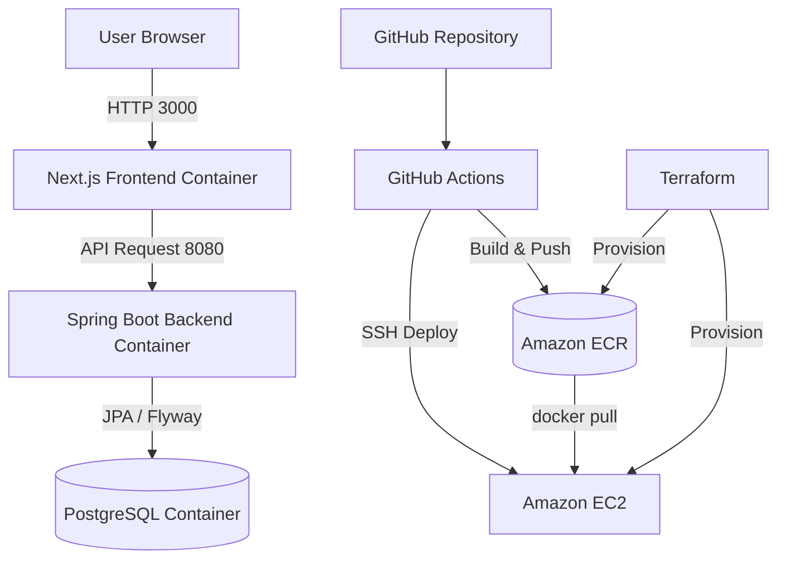

# Architecture

## システム構成

現在想定しているデプロイ構成は、`GitHub Actions + Amazon ECR + EC2 + Docker Compose` を基本としています。  
ローカルでは `docker-compose.yml`、AWS では `deploy/ec2/docker-compose.prod.yml` を使って同じ役割のコンテナ群を起動します。

## データフロー

### 1. アプリケーション利用時

1. ユーザーはブラウザから Next.js フロントエンドにアクセスします。
2. フロントエンドは JWT を使って Spring Boot バックエンド API を呼び出します。
3. バックエンドは PostgreSQL に対して応募、ステージ、日程、メモを永続化します。
4. スキーマ変更は Flyway migration で管理します。

### 2. デプロイ時

1. GitHub に push すると GitHub Actions が起動します。
2. バックエンドとフロントエンドの Docker イメージをビルドします。
3. ビルドしたイメージを Amazon ECR に push します。
4. GitHub Actions から EC2 に接続し、`docker compose pull && docker compose up -d` を実行します。

## インフラ構成の要点

- EC2 はアプリケーション実行基盤です。
- ECR はバックエンド / フロントエンドの Docker イメージ保管先です。
- Terraform は ECR、EC2、Security Group、IAM Role / Instance Profile などをコードで管理します。
- 現在の Terraform は `dev` 環境向けの最小構成です。
- PostgreSQL は現時点では EC2 上の Compose 内コンテナとして動かす前提です。

## 今後の拡張候補

- RDS への切り出し
- ALB + HTTPS 対応
- Route 53 によるドメイン管理
- CloudWatch 連携の強化
- Prometheus / Grafana の外部構成
