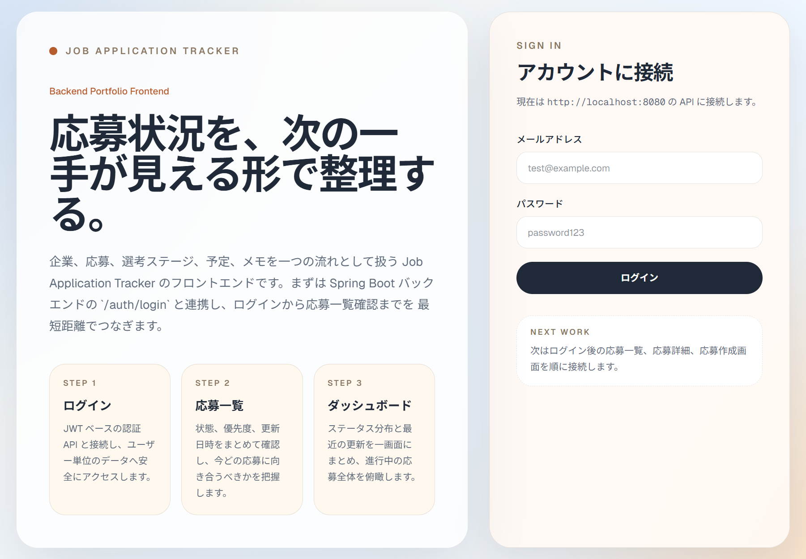
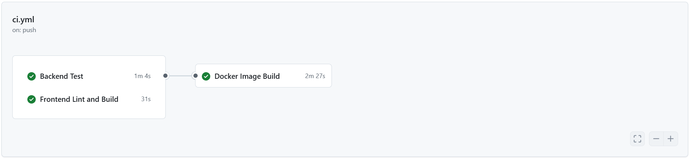
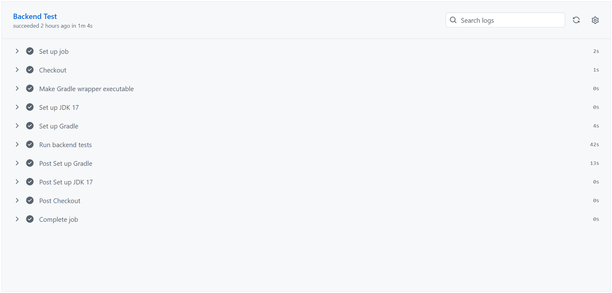
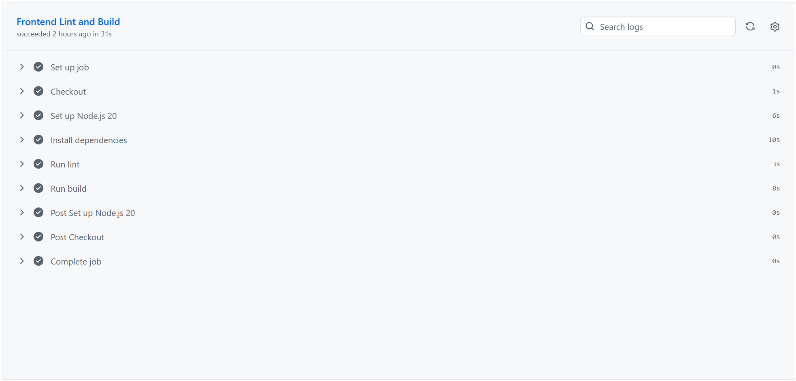
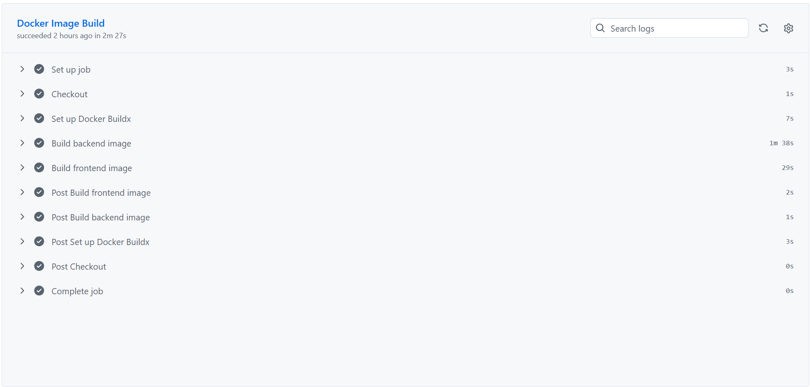
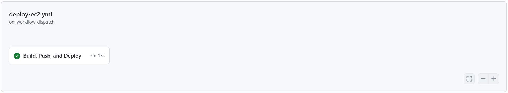
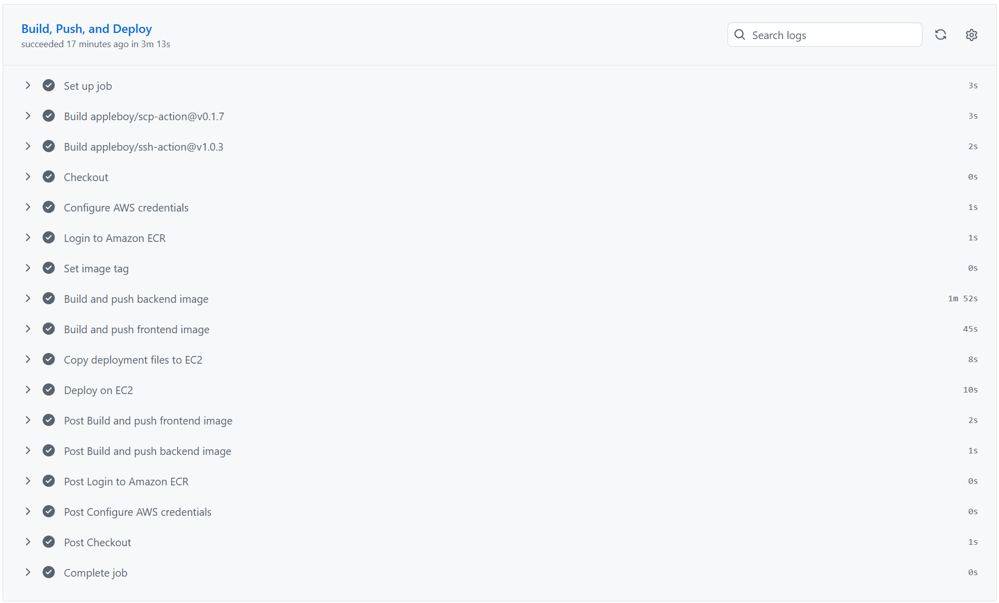
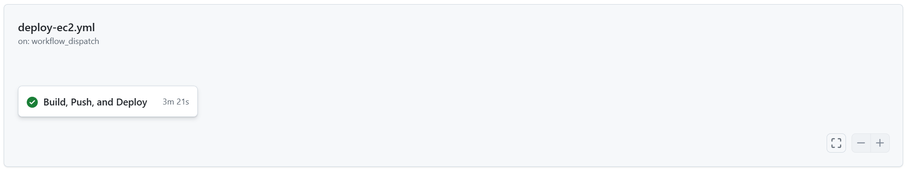
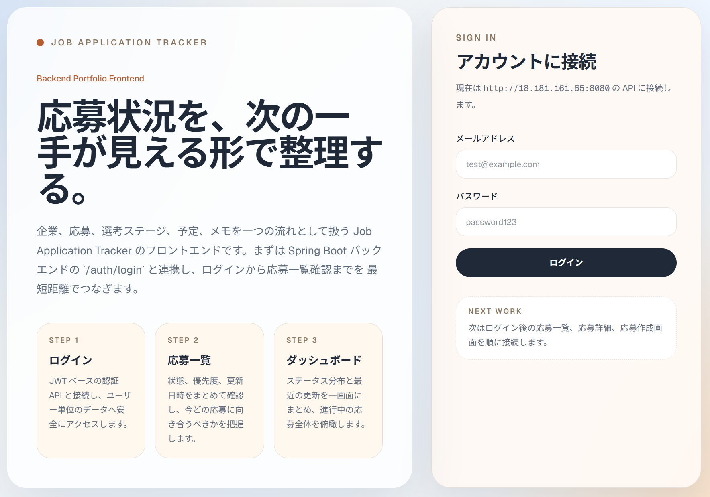

# Verification

このドキュメントでは、ローカル実行、ビルド、コンテナ起動、CI/CD、AWS デプロイ、Terraform 検証結果を整理します。
検証ログ全体ではなく、ポートフォリオとして確認すべき要点を残すことを目的としています。

---

## 1. ローカル Docker Compose 検証

### 実行コマンド

```powershell
docker compose up --build
```

### 検証日時

- 2026-04-13 JST

### 確認できたこと

`docker compose up --build` により、バックエンドとフロントエンドの Docker イメージビルドが完了しました。

```text
[+] up 4/4
 ✔ Image job-selection-tracker-backend      Built
 ✔ Image job-selection-tracker-frontend     Built
 ✔ Container job-selection-tracker-backend  Recreated
 ✔ Container job-selection-tracker-frontend Recreated
```

フロントエンドは Next.js の production server として起動できました。

```text
job-selection-tracker-frontend  | ▲ Next.js 16.2.3
job-selection-tracker-frontend  | - Local:   http://5c77a64e5e8a:3000
job-selection-tracker-frontend  | - Network: http://5c77a64e5e8a:3000
job-selection-tracker-frontend  | ✓ Ready in 0ms
```

PostgreSQL コンテナは初期化後、healthcheck により healthy になりました。

```text
job-selection-tracker-postgres  | PostgreSQL init process complete; ready for start up.
job-selection-tracker-postgres  | database system is ready to accept connections
Container job-selection-tracker-postgres Healthy
```

バックエンドの Docker ビルドでは、Gradle による `bootJar` 作成まで成功しました。

```text
> Task :bootJar
BUILD SUCCESSFUL in 24s
```

フロントエンドの Docker ビルドでは、Next.js の production build が成功しました。

```text
> frontend@0.1.0 build
> next build

✓ Compiled successfully
✓ Generating static pages using 9 workers (7/7)
```

### 検証中に発生した問題

バックエンドコンテナは起動時に PostgreSQL へ接続できず、終了しました。

```text
job-selection-tracker-backend | Error creating bean with name 'flywayInitializer':
job-selection-tracker-backend | Unable to obtain connection from database: The connection attempt failed.
job-selection-tracker-backend | Caused by: java.net.UnknownHostException: postgres
job-selection-tracker-backend exited with code 1
```

この時点では、以下は確認済みです。

- backend image build: 成功
- frontend image build: 成功
- frontend container startup: 成功
- postgres container startup: 成功
- postgres healthcheck: 成功
- backend container startup: 失敗

### `docker compose ps` の確認

`docker compose ps` では、frontend と postgres は起動中であることを確認しました。  
一方で、backend は DB 接続エラーにより終了しているため、一覧には表示されていません。

```text
NAME                             IMAGE                            SERVICE    STATUS
job-selection-tracker-frontend   job-selection-tracker-frontend   frontend   Up
job-selection-tracker-postgres   postgres:15                      postgres   Up (healthy)
```

### 初回検証時の判断

アプリケーション全体のビルドは成功していますが、ローカル Docker Compose の統合起動はバックエンドの DB 接続で失敗しているため、完了とはみなしません。  
原因は、バックエンドコンテナ内で `postgres` というサービス名を名前解決できていないことです。

次回確認する内容:

- `docker compose ps` によるコンテナ状態確認
- `docker network inspect` による compose network 参加状態確認
- backend コンテナの `DB_URL` が `jdbc:postgresql://postgres:5432/jobtracker` になっているか確認
- `docker compose down` 後に再起動して同じ事象が再現するか確認
- 必要に応じて backend に `restart` または DB 接続リトライ設定を追加

### 再確認結果

その後、フロントエンド画面とバックエンドのヘルスチェックを確認しました。

フロントエンド:

- URL: `http://localhost:3000`
- 確認結果: 画面表示成功



バックエンドヘルスチェック:

- URL: `http://localhost:8080/actuator/health`
- 確認結果: `UP`

```json
{
  "status": "UP",
  "groups": [
    "liveness",
    "readiness"
  ]
}
```

これにより、ローカル環境でフロントエンド画面表示とバックエンドのヘルスチェックが成功することを確認しました。

---

## 2. バックエンドテスト

### 実行コマンド

```powershell
./gradlew.bat test --no-daemon
```

### 検証日時

- 2026-04-13 JST

### 確認結果

バックエンドテストは成功しました。

```text
BUILD SUCCESSFUL in 9s
6 actionable tasks: 1 executed, 5 up-to-date
```

補足:

```text
Deprecated Gradle features were used in this build, making it incompatible with Gradle 9.0.
```

確認できた主な内容:

- 認証 API の基本動作
- ユーザー所有データへのアクセス制御
- 例外応答コード
- ステータス履歴生成
- ステータス遷移制御
- DB 制約違反時の応答
- サービス層のドメインルール

---

## 3. フロントエンド lint / build

### 実行コマンド

```powershell
cd frontend
npm run lint
npm run build
```

### 検証日時

- 2026-04-13 JST

### 確認結果

フロントエンドの lint と production build は成功しました。

```text
> frontend@0.1.0 lint
> eslint
```

lint はエラーなしで完了しました。

```text
> frontend@0.1.0 build
> next build

▲ Next.js 16.2.3 (Turbopack)
✓ Compiled successfully
✓ Finished TypeScript
✓ Collecting page data using 9 workers
✓ Generating static pages using 9 workers (7/7)
✓ Finalizing page optimization
```

生成された route:

```text
Route (app)
┌ ○ /
├ ○ /_not-found
├ ○ /applications
├ ƒ /applications/[id]
├ ○ /applications/new
└ ○ /companies/new

○  (Static)   prerendered as static content
ƒ  (Dynamic)  server-rendered on demand
```

---

## 4. GitHub Actions CI

### 検証内容

`.github/workflows/ci.yml` により、push 時に以下の job が実行され、すべて成功することを確認しました。

- Backend Test
- Frontend Lint and Build
- Docker Image Build

### CI 全体

`ci.yml` の workflow で、バックエンドテスト、フロントエンド lint / build、Docker イメージビルドがすべて成功しました。



### Backend Test

GitHub Actions 上で JDK 17 と Gradle をセットアップし、バックエンドテストが成功しました。



### Frontend Lint and Build

GitHub Actions 上で Node.js 20 をセットアップし、依存関係のインストール、lint、production build が成功しました。



### Docker Image Build

GitHub Actions 上で Docker Buildx をセットアップし、バックエンド / フロントエンドの Docker イメージビルドが成功しました。



---

## 5. GitHub Actions EC2 Deploy

### 検証内容

`.github/workflows/deploy-ec2.yml` を手動実行し、Docker イメージの ECR push と EC2 上での Docker Compose デプロイが成功することを確認しました。

### Deploy workflow 全体

`Build, Push, and Deploy` job が成功しました。



### Deploy job 詳細

以下の step がすべて成功しました。

- Checkout
- Configure AWS credentials
- Login to Amazon ECR
- Set image tag
- Build and push backend image
- Build and push frontend image
- Copy deployment files to EC2
- Deploy on EC2



### OIDC 方式への移行後のデプロイ確認

GitHub Actions の AWS 認証を `AWS_ACCESS_KEY_ID` / `AWS_SECRET_ACCESS_KEY` による long-lived access key 方式から、OIDC + IAM Role assume 方式へ変更しました。

OIDC 用 IAM Role は `terraform/envs/github-oidc` で dev 検証環境とは別 state として管理し、`AWS_ROLE_TO_ASSUME` を GitHub Secret に登録しています。

OIDC 移行後に `deploy-ec2.yml` を手動実行し、`Build, Push, and Deploy` job が成功することを確認しました。



確認できた主な内容:

- `Configure AWS credentials`
  - GitHub OIDC token により AWS IAM Role を assume
- `Login to Amazon ECR`
- `Build and push backend image`
- `Build and push frontend image`
- `Copy deployment files to EC2`
- `Deploy on EC2`

この検証により、GitHub Secrets に `AWS_ACCESS_KEY_ID` / `AWS_SECRET_ACCESS_KEY` を保存せず、OIDC による一時 credentials で ECR push と EC2 デプロイを実行できることを確認しました。

補足:

現在の EC2 デプロイは SSH / SCP ベースのため、検証時のみ Security Group の SSH inbound を一時的に開放しました。
検証後は SSH inbound を再度制限し、今後は SSM Run Command ベースのデプロイへ移行する予定です。

### EC2 上のフロントエンド接続確認

GitHub Actions によるデプロイ後、EC2 のパブリック IP 経由でフロントエンドにアクセスできることを確認しました。

- URL: `http://18.181.161.65:3000`
- 確認結果: 画面表示成功



### EC2 上のバックエンドヘルスチェック

EC2 上で起動しているバックエンドの Actuator health endpoint が `UP` を返すことを確認しました。

- URL: `http://18.181.161.65:8080/actuator/health`
- 確認結果: `UP`

```json
{
  "status": "UP",
  "groups": [
    "liveness",
    "readiness"
  ]
}
```

### EC2 上の Docker Compose 状態確認

EC2 上で `docker compose ps` を実行し、backend / frontend / postgres がすべて起動していることを確認しました。  
ECR の registry ID は公開用ドキュメントではマスクしています。

実行コマンド:

```bash
docker compose -f docker-compose.prod.yml --env-file .env ps
```

確認結果:

```text
NAME                             IMAGE                                                                                     SERVICE    STATUS
job-selection-tracker-backend    <AWS_ACCOUNT_ID>.dkr.ecr.ap-northeast-1.amazonaws.com/job-selection-tracker-backend:...    backend    Up
job-selection-tracker-frontend   <AWS_ACCOUNT_ID>.dkr.ecr.ap-northeast-1.amazonaws.com/job-selection-tracker-frontend:...   frontend   Up
job-selection-tracker-postgres   postgres:15                                                                                postgres   Up (healthy)
```

## 6. Terraform 検証

### 実行ディレクトリ

```powershell
cd terraform/envs/dev
```

### 検証内容

Terraform により、dev 環境向けの AWS リソースを作成し、検証後に削除できることを確認しました。  
AWS Account ID、public IP、VPC / Subnet / Security Group / Instance ID は公開用ドキュメントではマスクしています。

### `terraform plan`

`terraform plan` により、作成予定のリソースを確認しました。

```text
Plan: 5 to add, 0 to change, 0 to destroy.

Changes to Outputs:
  + backend_url    = (known after apply)
  + ec2_public_dns = (known after apply)
  + ec2_public_ip  = (known after apply)
  + frontend_url   = (known after apply)
```

作成予定として確認した主なリソース:

- EC2 instance
- IAM Role
- IAM Instance Profile
- IAM Role Policy Attachment
  - AmazonEC2ContainerRegistryReadOnly
  - AmazonSSMManagedInstanceCore

### `terraform apply`

`terraform apply` により、Terraform 管理リソースを作成できることを確認しました。

```text
Apply complete! Resources: 5 added, 0 changed, 0 destroyed.
```

確認できた outputs:

```text
backend_url  = "http://<EC2_PUBLIC_IP>:8080"
frontend_url = "http://<EC2_PUBLIC_IP>:3000"
```

この検証では、既存の ECR repository と Security Group の state を参照しつつ、EC2 実行用の IAM Role / Instance Profile と EC2 instance を作成しました。

### `terraform destroy`

検証後、`terraform destroy` により Terraform 管理リソースを削除できることを確認しました。

```text
Plan: 0 to add, 0 to change, 8 to destroy.
Destroy complete! Resources: 8 destroyed.
```

削除対象として確認した主なリソース:

- ECR repository
  - backend
  - frontend
- EC2 instance
- Security Group
- IAM Role
- IAM Instance Profile
- IAM Role Policy Attachment

### 補足

Terraform 検証時、EC2 用 IAM Role / Instance Profile を作成するために `iam:CreateRole` 権限が必要でした。  
検証中に必要な IAM 権限を付与し、`terraform apply` と `terraform destroy` の完了を確認しました。

### GitHub Actions OIDC stack

GitHub Actions の AWS 認証基盤は、dev 検証環境とは別に `terraform/envs/github-oidc` で管理しています。

実行ディレクトリ:

```powershell
cd terraform/envs/github-oidc
```

`terraform apply` により、以下のリソースを作成できることを確認しました。

```text
Apply complete! Resources: 3 added, 0 changed, 0 destroyed.
```

作成したリソース:

- GitHub Actions OIDC Provider
  - `token.actions.githubusercontent.com`
- GitHub Actions deploy IAM Role
  - `job-selection-tracker-prod-github-actions-deploy-role`
- ECR push 用 inline policy
  - `job-selection-tracker-prod-github-actions-ecr-push`

確認した output:

```text
github_actions_role_arn = "arn:aws:iam::<AWS_ACCOUNT_ID>:role/job-selection-tracker-prod-github-actions-deploy-role"
github_oidc_provider_arn = "arn:aws:iam::<AWS_ACCOUNT_ID>:oidc-provider/token.actions.githubusercontent.com"
```

この stack はデプロイ認証基盤として維持し、`terraform/envs/dev` の `destroy` 対象から分離しています。

### Terraform remote backend

Terraform state をローカルファイルではなく S3 backend で管理するため、`terraform/envs/remote-state` を追加しました。

実行ディレクトリ:

```powershell
cd terraform/envs/remote-state
```

`terraform apply` により、remote state 用の S3 bucket と DynamoDB lock table を作成できることを確認しました。

```text
Apply complete! Resources: 5 added, 0 changed, 0 destroyed.
```

作成した主なリソース:

- S3 bucket
  - Terraform state 保存用
  - versioning 有効
  - server-side encryption 有効
  - public access block 有効
- DynamoDB table
  - Terraform state lock 用
  - `PAY_PER_REQUEST`

確認した outputs:

```text
state_bucket_name       = "jst-tfstate-<AWS_ACCOUNT_ID>-apne1"
lock_table_name         = "job-selection-tracker-terraform-locks"
dev_backend_key         = "job-selection-tracker/dev/terraform.tfstate"
github_oidc_backend_key = "job-selection-tracker/github-oidc/terraform.tfstate"
```

### S3 backend migration

`terraform/envs/github-oidc` と `terraform/envs/dev` を S3 backend に切り替えました。

`github-oidc` stack:

```powershell
cd terraform/envs/github-oidc
terraform init -backend-config="backend.hcl" -migrate-state
terraform state list
terraform plan
```

state migration 後、OIDC 関連リソースが remote state から参照できることを確認しました。

```text
data.aws_caller_identity.current
aws_iam_openid_connect_provider.github_actions[0]
aws_iam_role.github_actions_deploy
aws_iam_role_policy.github_actions_ecr_push
```

`terraform plan` は差分なしでした。

```text
No changes. Your infrastructure matches the configuration.
```

`dev` stack:

```powershell
cd terraform/envs/dev
terraform init -backend-config="backend.hcl" -migrate-state
terraform plan
```

`dev` 環境は検証後に `destroy` 済みのため、state 上に管理中リソースはありませんでした。
S3 backend への切り替え後、`terraform plan` が正常に実行され、現在の構成から作成される dev リソースを確認できました。

```text
Plan: 8 to add, 0 to change, 0 to destroy.
```

この検証により、以下を確認しました。

- remote state bootstrap stack の作成
- `github-oidc` stack の local state から S3 backend への migration
- `github-oidc` stack の drift なし確認
- `dev` stack の S3 backend 初期化
- `dev` stack で remote backend 経由の `terraform plan` 実行

補足:

remote state 用の S3 bucket / DynamoDB lock table は、他の Terraform stack が state を保存するための基盤です。
そのため、通常の dev 検証リソースのように毎回 `destroy` する対象ではありません。
